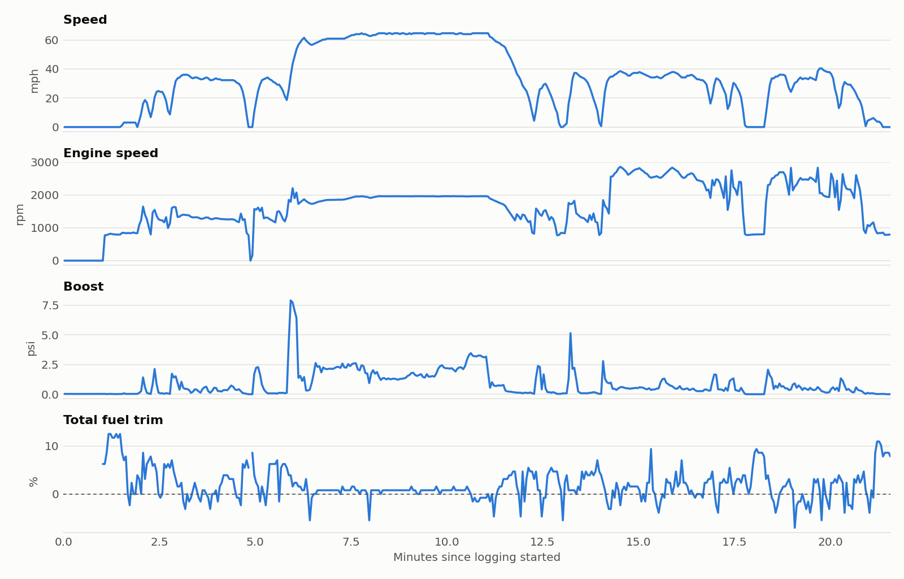

# CarPi

A Raspberry Pi that lives on my Audi's OBD-II port, asks the engine ECU for 25 live values about 8 times a second, and writes one CSV per drive.

<picture>
  <source media="(prefers-color-scheme: dark)" srcset="docs/images/drive-trace-dark.png">
  
</picture>

<sub>The first baseline drive, Sept 2026. The fuel-trim spikes line up with idle. More on that <a href="docs/baseline-2026-09-25.md">below</a>.</sub>

## Why

I'm planning some mechanical work and eventually a Stage 1 tune on my 2017 A3 (EA888 Gen 3), and I wanted real before/after data rather than guesswork. Off-the-shelf OBD dongles show gauges; I wanted raw, timestamped logs I could compare in pandas.

It took two tries. In July, a passive `candump` on the OBD port showed exactly one frame: the gateway's keep-alive. The car's J533 gateway keeps powertrain traffic off the port, so there's nothing to listen to. In September I came back and made CarPi ask for each value instead.

## What it does

- **Polls the ECU over SocketCAN** with standard OBD-II Mode 01 requests, including a small hand-rolled ISO-TP layer for multi-frame replies (boost pressure).
- **Logs automatically.** It detects when the engine starts, opens a new CSV, and closes it when the ignition goes off. Nothing to start by hand.
- **Won't drain the battery.** It never transmits while the car's bus is asleep.
- **Survives power cuts.** The car's USB port dies instantly at ignition-off; `fsync` every 5 s and atomic metadata writes mean at most a few seconds are lost.
- **Runs as systemd services**, and depends on nothing but `python-can`.

How the polling, ISO-TP and state machine work: [docs/how-it-works.md](docs/how-it-works.md)

## Hardware

| Part | Details |
| --- | --- |
| Car | 2017 Audi A3 8V, EA888 Gen 3, DQ250 DSG |
| Computer | Raspberry Pi 4 (2 GB), Raspberry Pi OS 13, headless |
| CAN interface | MCP2515 + SIT65HVD230 SPI CAN HAT (12 MHz crystal, IRQ on GPIO 25) |
| Cable | OBD-II pigtail: pin 6 → CAN-H, pin 14 → CAN-L |
| Power | The car's USB port |

The bus is 500 kbps high-speed CAN with 11-bit IDs (ISO 15765-4).

## Setup

**1. Enable the CAN HAT.** Add to `/boot/firmware/config.txt` and reboot:

```ini
dtparam=spi=on
dtoverlay=mcp2515-can0,oscillator=12000000,interrupt=25,spimaxfrequency=2000000
```

Some HATs use an 8 MHz crystal (`oscillator=8000000`). `dmesg | grep mcp251` should report `MCP2515 successfully initialized`.

**2. Install and enable the services.**

```bash
sudo apt install -y can-utils python3-can
git clone https://github.com/YurySergeev/carpi.git ~/carpi
sudo cp ~/carpi/systemd/*.service /etc/systemd/system/
sudo systemctl daemon-reload
sudo systemctl enable --now can0 carpi-logger
```

The logger unit assumes user `carpi` and the repo at `/home/carpi/carpi`. Adjust `systemd/carpi-logger.service` if yours differ.

## Usage

With the Pi plugged in and powered, every engine start becomes a new `~/carpi/logs/drive-<start>.csv`.

```bash
journalctl -u carpi-logger -f               # watch it live
echo post-pcv > ~/carpi/tag.txt             # label upcoming drives for before/after comparisons
scp "carpi@carpi.local:~/carpi/logs/*" .    # pull logs to a PC
```

To see what your car supports, stop the logger and run the probe:

```bash
sudo systemctl stop carpi-logger
python3 ~/carpi/probe_addressing.py          # addressing, supported PIDs, decoded values
python3 ~/carpi/probe_addressing.py --watch  # live values once a second
sudo systemctl start carpi-logger
```

Columns, decoding formulas and metadata: [docs/data-format.md](docs/data-format.md). The baseline drive is in [`data/`](data) if you want to poke at real numbers.

## First results

On the first 21-minute drive, every decoded value matched a physical reference: boost equals barometric pressure at idle, actual λ tracks commanded λ, rail pressure and idle rpm land where they should.

One real finding: **total fuel trim is +8.6% at idle but under 1% while driving.** A correction that only shows up at idle usually means unmetered air, and on this engine the PCV valve is the classic suspect. The next logs will be tagged `post-pcv` for a before/after comparison.

Full report: [docs/baseline-2026-09-25.md](docs/baseline-2026-09-25.md)

## Roadmap

- [ ] Clean shutdown on ignition-off (UPS HAT or ignition-sense power)
- [ ] Drive-summary script: per-drive report and before/after comparison by tag
- [ ] Full-throttle baseline pulls before the tune
- [ ] VW-specific data over UDS: per-cylinder knock retard, oil temperature, DSG temperature
- [ ] Live dashboard

## A note on safety

CarPi only sends standard, read-only OBD-II Mode 01 requests, the same ones any scan tool sends. It never writes to the car. Don't fiddle with it while driving.

## License

[MIT](LICENSE). Developed with help from [Claude](https://claude.ai).
