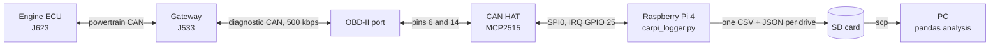
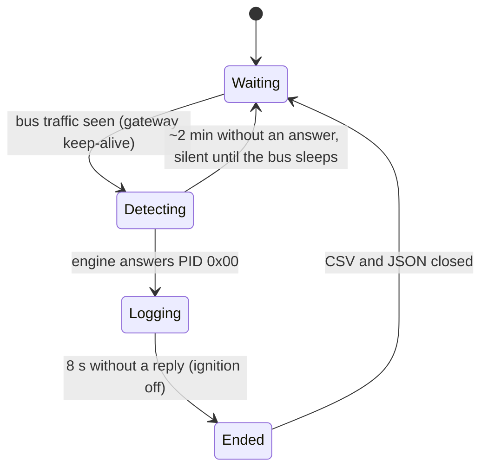

# How it works

## Why listening isn't enough

On the Audi's MQB platform, the J533 gateway keeps powertrain traffic off the OBD port. A passive `candump` with the engine running sees exactly one frame, the gateway's keep-alive:

```
(1783030596.181238) can0 17F00010#2010000000000000   # ~2 Hz, identical every time
```

So CarPi asks for every value it needs. A real exchange from the car:

| Step | CAN ID | Data | Meaning |
| --- | --- | --- | --- |
| Request | `0x7E0` | `02 01 0C 55 55 55 55 55` | Mode 01, PID `0x0C` (RPM), padded to 8 bytes |
| Reply | `0x7E8` | `04 41 0C 0C 77 …` | `0x0C77` / 4 = 797.75 rpm |

If the engine doesn't answer on its physical address (`0x7E0`), the logger falls back to the functional broadcast ID `0x7DF`.

## Multi-frame replies (ISO-TP)

Boost pressure (PID `0x70`) comes back as 12 bytes, too long for one CAN frame. The ECU sends a First Frame, CarPi answers with a Flow Control frame (`30 00 05`: send everything, 5 ms apart), and the ECU sends Consecutive Frames. The reassembly is about 20 lines in `Engine.request()`, so `python-can` stays the only dependency.

## Data path



## Logger states



- **Waiting:** listen only. Kernel-level CAN filters pass only engine replies (`0x7E8`) and the gateway keep-alive. Nothing is transmitted while the car is asleep, so the Pi can't wake it or drain the battery.
- **Detecting:** a `PID 0x00` request every 3 s, for at most ~2 minutes per bus wake-up.
- **Logging:** read the ECU's supported-PID bitmaps, then poll 12 fast PIDs every loop plus one of 12 slow PIDs (round-robin), capped at 10 rows/s.
- **Ended:** final `fsync`, and the metadata is marked complete.

## Surviving power cuts

The car's USB port drops power the moment the ignition turns off, so the logger assumes it can die at any time:

- the CSV is line-buffered and `fsync`ed every 5 s,
- the JSON metadata is written to a temp file and atomically renamed, every 30 s,
- a drive that never closed cleanly keeps `"complete": false`.

At most about 5 s of data is lost per cut.

## Testing

Both scripts were first run against a simulated ECU on a `python-can` virtual bus: bus sleep and wake, ignition cycles, the multi-frame boost reply, and a service stop mid-drive. Then they were validated on the car.
